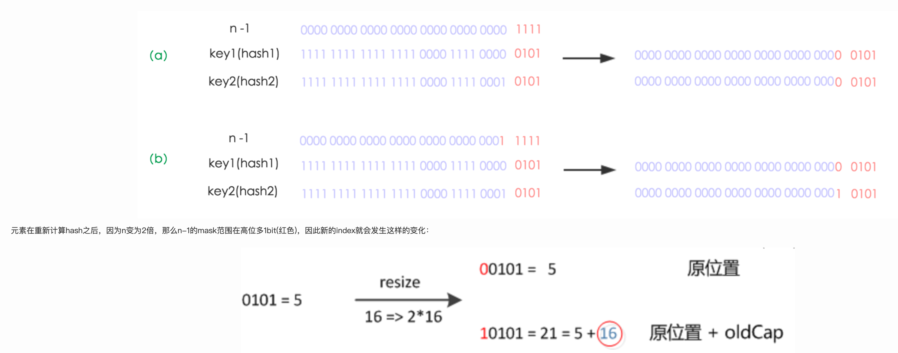

#### 認識HashMap

* 特性:
  * 可利用key找到value, key and value皆允許為null
  * 內部利用Key的hashcode儲存Value, 具有非常快的訪問速度
  * 不保證遍歷的順序
  * 非Thread-Safe

##### 內部實現
* 結構: array + linked-list + red block tree (經過java 8 優化)


1. 從程式得知內部利用array儲存資料, 也可以稱為hash table, hash table裡面的資料稱為 hash bucket (哈希桶), 呼印上圖
```java
transient Node<K,V>[] table;
```
```java
static class Node<K,V> implements Map.Entry<K,V> {
  final int hash;
  final K key;
  V value;
  Node<K,V> next;

  Node(int hash, K key, V value, Node<K,V> next) {
    this.hash = hash;
    this.key = key;
    this.value = value;
    this.next = next;
  }

  public final K getKey()        { return key; }
  public final V getValue()      { return value; }
  public final String toString() { return key + "=" + value; }

  public final int hashCode() {
    return Objects.hashCode(key) ^ Objects.hashCode(value);
  }

  public final V setValue(V newValue) {
    V oldValue = value;
    value = newValue;
    return oldValue;
  }

  public final boolean equals(Object o) {
    if (o == this)
      return true;
    if (o instanceof Map.Entry) {
      Map.Entry<?,?> e = (Map.Entry<?,?>)o;
      if (Objects.equals(key, e.getKey()) &&
              Objects.equals(value, e.getValue()))
        return true;
    }
    return false;
  }
}
```
2. 計算hash code決定要放在hash table中的哪個位置, 若有衝突發生一般有兩種方式解決 '開放地址法' '鏈地址法', java採用後者, 當鏈結長度超過8時會改用紅黑樹儲存. <br>
第一步會希望先知道這個key到底在hash table的哪個位置, 分為三個步驟. 1. 取得key的hashcode 2. 高位參與運算 3. 取模運算

```java
public V put(K key, V value) {
        return putVal(hash(key), key, value, false, true);
    }
```

```java
static final int hash(Object key) {
        int h;
        //key為null固定使用hash table第一個位置
        //h=key.hashCode 接著高位元參與互斥或運算
        return (key == null) ? 0 : (h = key.hashCode()) ^ (h >>> 16);
    }
```

```java
//java 7, java 8 沒有這個方法但是原理是一樣的, length預設16
static int indexFor(int h, int length) {  
    //取模運算, & 效能比%好
    return h & (length-1);
}
```

```text
hashcode如下 (int 8 bytes)
h: 1111 1111 1111 1111 1111 0000 1110 1010
-----------------------------------------------------
計算hash
h:      1111 1111 1111 1111 1111 0000 1110 1010
h>>>16: 0000 0000 0000 0000 1111 1111 1111 1111
XOR:    1111 1111 1111 1111 0000 1111 0001 0101
-----------------------------------------------------
模運算
0000 0000 0000 0000 0000 0000 0000 1111
1111 1111 1111 1111 0000 1111 0001 0101
-----------------------------------------------------
最後算出hash table 位置為 0101 = 5, 位於array第5格
```


3. 如果hash table很大則不好的hash算法也會有小的碰撞率, 反之hash table小就算hash算法很好也會有很大的碰撞率. <br>
   hash table小且hash碰撞率低是最好的, 這就會需要一個好的擴容、hash算法. <br>
```java
int threshold; //key-value上限
final float loadFactor;  //附載因子
int modCount;  //結構改變次數
int size;  //元素數量
```
Node[] table 的初始化預設長度為16 (設計上一定為2的n次方), loadFactor預設為0.75, threshold是可容納最多的Node個數.
threshold = length * Load factor, 也就是說長度固定的情況下附載因子越大容量越大, 超過threshold開始擴容, 擴容大小為原本的**兩倍** <br>
因擴容, hash table已經變為原本的兩倍, 按道理來說需要依據每個node hash 重新分配hash table idx, 有可能同個bucket上的點最後被分配到不同的bucket. <br>
下面舉例: <br>
設hash算法就是用vaule mod table length且loadFactor=1, 則resize過程如下圖

<br>
可以發現java 8 做的一個優化因為長度為原本的兩倍 (2的n次方), 所以元素一定是在**原位置**或者與**多出的bit相加**的位置如下圖 <br>
n為table長度; a為擴容前; b為擴容後 (h & (length-1))

**所以java8 hashmap在擴容時不需利用hash計算每個點的位置, 只要看新增的bit計算後是0還是1即可**


##### 分析put方法


```java
public V put(K key, V value) {
    //計算hash後呼叫putVal
        return putVal(hash(key), key, value, false, true);
    }
```

```java
final V putVal(int hash, K key, V value, boolean onlyIfAbsent,
                   boolean evict) {
        Node<K,V>[] tab; Node<K,V> p; int n, i;
        //step1. hash table 為空的話則建立
        if ((tab = table) == null || (n = tab.length) == 0)
            n = (tab = resize()).length;
        //step2. 計算index, 判斷是否碰撞, 若沒有則生成node 
        if ((p = tab[i = (n - 1) & hash]) == null)
            tab[i] = newNode(hash, key, value, null);
        else {
            Node<K,V> e; K k;
            //step3. 碰撞了, 如果說hash一樣且兩個物件相等 (equals) 就直接覆蓋value即可
            if (p.hash == hash &&
                ((k = p.key) == key || (key != null && key.equals(k))))
                e = p;
            //step4. 如果為紅黑樹則向樹中插入
            else if (p instanceof TreeNode)
                e = ((TreeNode<K,V>)p).putTreeVal(this, tab, hash, key, value);
            else {
                //step5. 走到這邊代表 已經確定碰撞而且linked-list第一個點也不相等, 開始依序訪問鏈表
                //如果鏈的長度超過8會整理為紅黑樹, 若節點相等還是會蓋掉, 不相等就串在鏈尾
                for (int binCount = 0; ; ++binCount) {
                    if ((e = p.next) == null) {
                        p.next = newNode(hash, key, value, null);
                        if (binCount >= TREEIFY_THRESHOLD - 1) // -1 for 1st
                            treeifyBin(tab, hash);
                        break;
                    }
                    if (e.hash == hash &&
                        ((k = e.key) == key || (key != null && key.equals(k))))
                        break;
                    p = e;
                }
            }
            if (e != null) { // existing mapping for key
                V oldValue = e.value;
                if (!onlyIfAbsent || oldValue == null)
                    e.value = value;
                afterNodeAccess(e);
                return oldValue;
            }
        }
        ++modCount;
        //step6. 超過容量就擴容
        if (++size > threshold)
            resize();
        afterNodeInsertion(evict);
        return null;
    }
```

##### resize程式分析
```java
final Node<K,V>[] resize() {
        Node<K,V>[] oldTab = table;
        int oldCap = (oldTab == null) ? 0 : oldTab.length;
        int oldThr = threshold;
        int newCap, newThr = 0;
        if (oldCap > 0) {
            //最容量已達最大容量, 就不擴充了, 碰撞吧 
            if (oldCap >= MAXIMUM_CAPACITY) {
                threshold = Integer.MAX_VALUE;
                return oldTab;
            }
            //沒超過最大值就兩倍增長
            else if ((newCap = oldCap << 1) < MAXIMUM_CAPACITY &&
                     oldCap >= DEFAULT_INITIAL_CAPACITY)
                newThr = oldThr << 1; // double threshold
        }
        else if (oldThr > 0) // initial capacity was placed in threshold
            newCap = oldThr;
        else {               // zero initial threshold signifies using defaults
            newCap = DEFAULT_INITIAL_CAPACITY;
            newThr = (int)(DEFAULT_LOAD_FACTOR * DEFAULT_INITIAL_CAPACITY);
        }
        //計算新的容量
        if (newThr == 0) {
            float ft = (float)newCap * loadFactor;
            newThr = (newCap < MAXIMUM_CAPACITY && ft < (float)MAXIMUM_CAPACITY ?
                      (int)ft : Integer.MAX_VALUE);
        }
        threshold = newThr;
        @SuppressWarnings({"rawtypes","unchecked"})
        Node<K,V>[] newTab = (Node<K,V>[])new Node[newCap];
        table = newTab;
        if (oldTab != null) {
            //訪問每個點, 計算新的hash table位置
            for (int j = 0; j < oldCap; ++j) {
                Node<K,V> e;
                if ((e = oldTab[j]) != null) {
                    //釋放舊table的指向
                    oldTab[j] = null;
                    //沒有碰撞就直接計算
                    if (e.next == null)
                        newTab[e.hash & (newCap - 1)] = e;
                    else if (e instanceof TreeNode)
                        ((TreeNode<K,V>)e).split(this, newTab, j, oldCap);
                    else { // preserve order
                        Node<K,V> loHead = null, loTail = null;
                        Node<K,V> hiHead = null, hiTail = null;
                        Node<K,V> next;
                        do {
                            //有碰撞就看點的hash多出
                            next = e.next;
                            //假設第一次擴容,這邊oldCap是16, 0001 1111
                            //若and為0則表多出來的位元為0, 代表擴容後為原索引
                            if ((e.hash & oldCap) == 0) {
                                if (loTail == null)
                                    loHead = e;
                                else
                                    loTail.next = e;
                                loTail = e;
                            }
                            //多出來的位元為0, 原索引+oldCap
                            else {
                                if (hiTail == null)
                                    hiHead = e;
                                else
                                    hiTail.next = e;
                                hiTail = e;
                            }
                        } while ((e = next) != null);
                        if (loTail != null) {
                            loTail.next = null;
                            newTab[j] = loHead;
                        }
                        if (hiTail != null) {
                            hiTail.next = null;
                            newTab[j + oldCap] = hiHead;
                        }
                    }
                }
            }
        }
        return newTab;
    }
```


[參考資料](https://tech.meituan.com/2016/06/24/java-hashmap.html)

