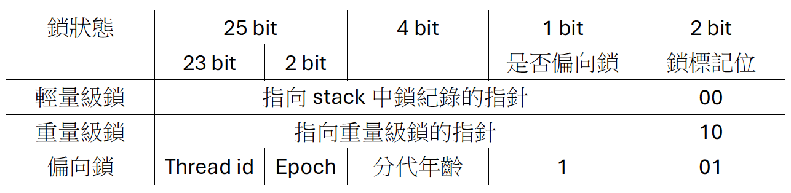

### synchronized的原理與應用

#### 利用synchronized實現同步的基礎
* java中每個物件都可以作為鎖, 可依分為下面三種形式
  * 普通同步方法, 鎖的是當前物件實例
  * static同步方法, 鎖的是當前類別的Class對象
  * 同步區塊, 鎖的是synchronized配置的物件

從JVM規範來說, JVM基於進入與退出Monitor對象來實現方法同步和同步區塊, 但這兩種的實作細節不同.  
1. 同步區塊: 使用monitorenter、monitorexit指令實作, monitorenter指令在編譯後插入同步區塊的開始位置,  
            monitorexit則會插入到結束處與異常處, JVM會保證每個monitorenter都會有其對應的monitorexit
2. 同步方法: 沒有明確說明該用什麼方式實作, 但要用monitorenter、monitorexit指令也是可以的.

任何物件都會有一個monitor與之關聯, 當一個monitor被持有後會處於鎖定狀態, thread執行到monitorenter指令時會嘗試獲得物件所有權, 也就是嘗試獲得物件的鎖.

### java 物件頭
synchronized用的鎖是存在java物件頭部內的, 如果是array則JVM會用3 word去儲存, 反之2 word去儲存.  
ps. 32 bit JVM 1 word = 4byte;  64 bit JVM 1 word = 8 byte

java物件頭資料結構

| 長度        | 內容                     | 說明                    |
|-----------|------------------------|-----------------------|
| 32/64 bit | Mark Word              | 儲存物件的hash code 或 鎖的資料 |
| 32/64 bit | Class Metadata Address | 儲存物件類型資料的指針           |
| 32/64 bit | Array Length           | array 長度              |

  java物件Mark Word儲存的結構 (32 bit 為例)

| 鎖狀態 | 25bit     | 4bit | 1bit | 2bit |
|-----|-----------|------|------|------|
| 無鎖  | hash code | 分代年齡 | 0    | 01   |

  Mark Word 狀態變化

### 鎖的升級與比較
#### 偏向鎖
大多數情況下, 鎖不存在多執行續競爭, 而且總是由同一個Thread多次獲得.  
為了讓獲取鎖的開銷變低, 引進了偏向鎖. 獲取鎖時會把thread-id寫入至Mark Word 內, 以後thread 獲取/釋放鎖時就不需要再進行CAS操作.  
鎖的獲取/釋放/競爭 大致流程如下
1. 初次偏向 (當前無鎖狀態): 執行CAS操作, 將thread-id、偏向鎖標誌、鎖標誌寫入Mark Word
2. 非初次偏向: 如果不是第一次, 則看Mark Word 內的thread-id是否為當前thread-id, 如果是則無需獲取鎖, 即可進入臨界區間
   如果否代表發生鎖的競爭
3. 鎖的競爭: 檢查Mark Word內記錄的thread是否存活, 如果沒有存活則將鎖變為無鎖狀態, 當前thread可以獲取鎖 (CAS 操作設定thread id 等)
            但如果thread還存活著就要檢查是否在臨界區間內, 如果還在區間內則執行**鎖撤銷**, 但若已離開則將鎖重置為無鎖狀態, 當前thread可以獲取偏向鎖
4. 撤銷偏向鎖: 需等待至全局安全點後 (在這個時間點沒有正在執行的byte-code), 暫停擁有鎖的thread, 將鎖升級為**輕量級鎖**, 接著喚醒被暫停的thread, 此thread可以接續競爭輕量級鎖
             , 若競爭激烈可能會更近一步升級為重量級鎖.
 

ps. 安全點通常位於方法調用、循環迭代等位置, 而不是在臨界區間內, 所以不會發生執行臨界區間到一半時因為鎖撤銷導致鎖被搶走的問題
 
ps. 偏向鎖的撤銷與升級是一個相對昂貴的操作, 因此JVM有一些策略來決定是否禁用某些物件的偏向鎖.

#### 輕量級鎖
1. 加鎖: 執行臨界區間前JVM會先在當前stack中建立一個用於儲存**鎖紀錄**的空間,
        接著嘗試將鎖的Mark Word複製到紀錄中, 這個行為稱Displaced Mark Word. 
        然後嘗試使用CAS把一個指向鎖紀錄的指針寫入Mark Word內, 如果成功代表獲取鎖, 失敗代表有競爭者, 
        則會**自旋**來嘗試獲取鎖, 期待持有鎖的thread能趕快釋放鎖, 自旋失敗後會把鎖膨脹成重量級鎖, 以便競爭的thread能夠阻塞.
2. 解鎖: 使用CAS操作將Displaced Mark Word替換回物件頭, 如果成功代表沒有競爭, 失敗的話鎖會膨脹成重量級鎖, 以便競爭的thread能夠阻塞.

 

#### 重量級鎖 (簡述)
* 加鎖流程
  * thread進入臨界區間時會調用monitorenter指令
  * 如果監視器的記數數量為0代表監視器空閑, 將數量設定為1獲取鎖
  * 如果數量不為0, 但當前thread已經擁有鎖, 則計數器會加1 (可重入)
  * 如果數量不為0, 且非當前thread持有, 當前thread會阻塞, 進入監視器等待列隊
* 解鎖流程
  * 當thread離開臨界區間, 會呼叫monitorexit指令
  * 監視器的counter會減1
  * 如果計數器為0代表完全釋放鎖
  * 如果等待列隊中有其他thread則會喚醒其中一個or多個來競爭鎖 (是不公平的)

* 鎖的實現
  * 在底層，重量級鎖通常使用作業系統的互斥量（mutex）來實現
  * 這意味著執行續的阻塞和喚醒操作都涉及到作業系統級別的上下文切換，這是重量級鎖效率相對較低的主要原因。

 

#### 比較

| 鎖    | 優點                    | 缺點                   | 是用場景                   |
|------|-----------------------|----------------------|------------------------|
| 偏向鎖  | 加鎖/解鎖不需要額外開銷          | 如果出現鎖競爭, 會帶來額外撤銷鎖的開銷 | 適用於只有一個thread訪問臨界區間的場景 |
| 輕量級鎖 | 競爭的thread不會阻塞, 提供響應速度 | 競爭不到鎖時會自旋消耗CPU       | 追求響應時間, 臨界區間執行快        |
| 重量級鎖 | 競爭不自旋, 不會消耗cpu        | thread組塞, 響應時間慢      | 追求吞吐量、臨界區間執行較慢         |
