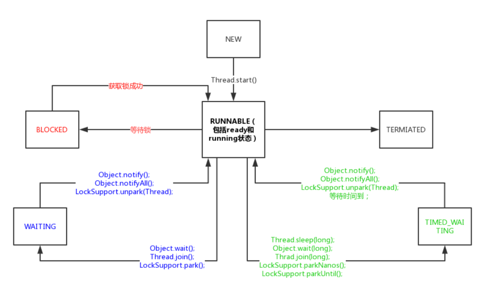

### Java Thread State

#### Thread 狀態變更關係圖


* New: Thread剛被建立出來尚未呼叫start()
* Runnable: 已經在JVM中運行, 也可能正在等待cpu排班分配資源
* Blocked: 正在等待鎖, t1持有鎖, t2正在等待其釋放此時t2狀態為Blocked
* Waiting: 等待狀態, 需要其他Thread將其喚醒才有機會進入Runnable
* Timed_Waiting: 也是等待狀態, 但與Waiting狀態不同的是這種等待狀態只會等待一段時間, <br>
   時間到了會自動進入Runnable.
* Terminated: Thread執行完畢


#### Runnable --> Waiting
從Runnable要進入Waiting狀態有下面三種方法
1. Object.wait: 呼叫Object.wait時需要持有該物件的鎖, Thread調用wait時會釋放鎖直到有其他Thread呼叫 notify/notifyAll <br>
   呼叫notify 只會喚醒一個等待鎖的Thread, notifyAll則是多個, 當然具體哪個還是要看作業系統調度
```java
public class TestWaitNotify {

    private static final Object lock = new Object();

    @SneakyThrows
    public static void main(String[] args) {
        SumCal sumCal = new SumCal();
        Thread t1 = new Thread(sumCal);
        t1.start();
        synchronized (lock){
            lock.wait();
        }
        System.out.println(sumCal.sum);
    }

    public static class SumCal implements Runnable{

        int sum = 0;

        @SneakyThrows
        @Override
        public void run() {
            TimeUnit.MILLISECONDS.sleep(100L);
            synchronized (lock){
                for (int i = 0; i < 50; i++) {
                    sum++;
                }
                lock.notifyAll();
            }
        }
    }

}
```
2. Thread.join: 會一直等待到這個Thread執行完畢 (Terminated)
3. LockSupport

#### Timed_Waiting --> Runnable
1. Thread.sleep(long): 讓當前Thread睡眠, 但睡眠期間並不會釋放鎖, 時間到期後會自動進入Runnable
2. Object.wait(long): 用法與wait()相同, 不同的是會在指定時間到期後自動擁有競爭鎖的資格
3. Thread.join(long): 在超時時間內, 調用Thread的狀態為Timed_Waiting, 直到被調用Thread 到期或執行結束被調用Thread才重回Runnable