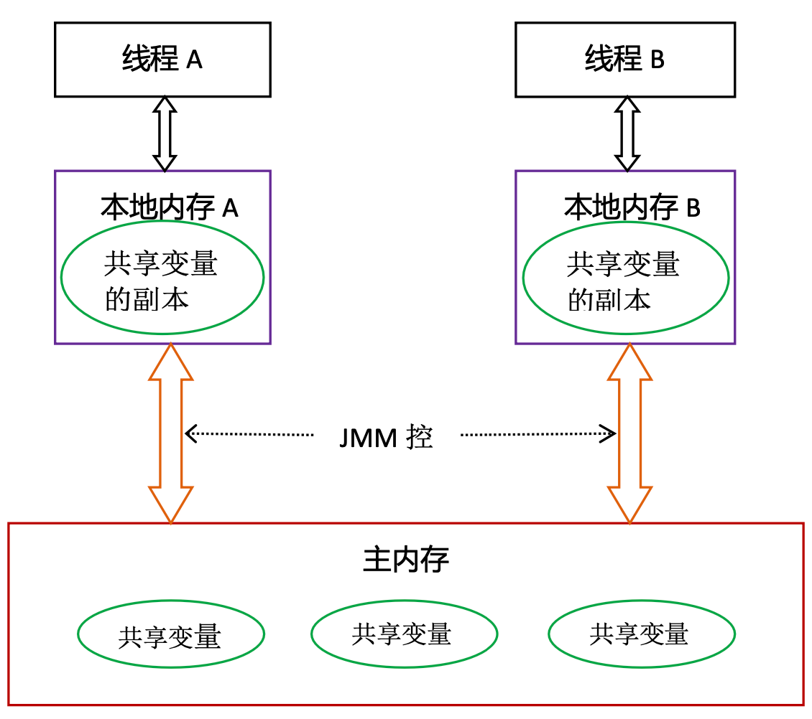

### Java記憶體模型的抽象

在java中所謂共享變數是指: static 宣告的實例變數、靜態變數,   
本地變數、方法變數、exception handler parameters 不在此內, 這些變數不會有記憶體可見性的問題, 也不受JMM引響.  
 

在多CPU的設計架構中, 每個CPU都會有自己的Cache,所以導致每個CPU看到的資料可能都不盡相同,  
進而導致出錯的情況, 為了解決這個問題以及簡化複雜度Java抽象化這部分的概念.  

#### JMM對記憶體模型的抽象
Java Thread之間的通信由JMM決定, JMM決定一個共享變數何時讓其他Thread可見.  
 
* JMM定義了Thread與主記憶體之間的抽象關係: 共享變數儲存在主記憶體中, 每個Thread都有一個私有的本地記憶體,
本地記憶體儲存了共享變數的副本. 本地私有記憶體是一個抽象概念, 實際並不存在這東西, 這概念涵蓋了Cache、Write Buffer、CPU Register
* 抽象示意圖
  

Thread A 要與 Thread B通信的話需歷經下面幾個步驟, 提供記憶體可見性的保證.
1. Thread A 把本地記憶體更新至主記憶體
2. Thread B要主記憶體讀取共享變數