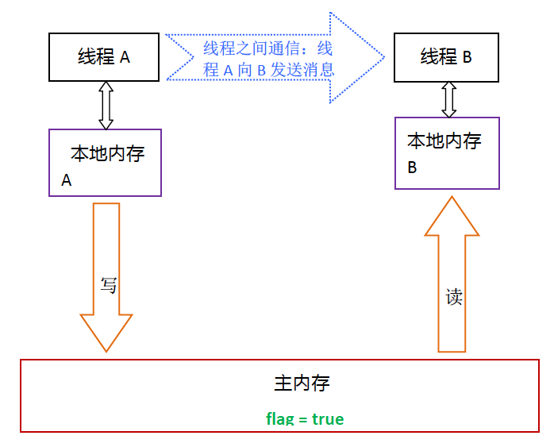
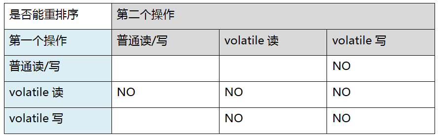
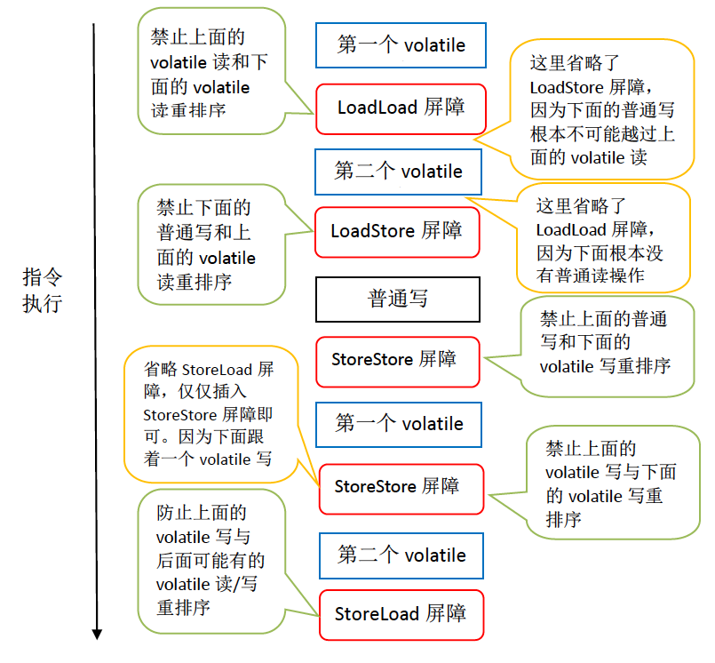
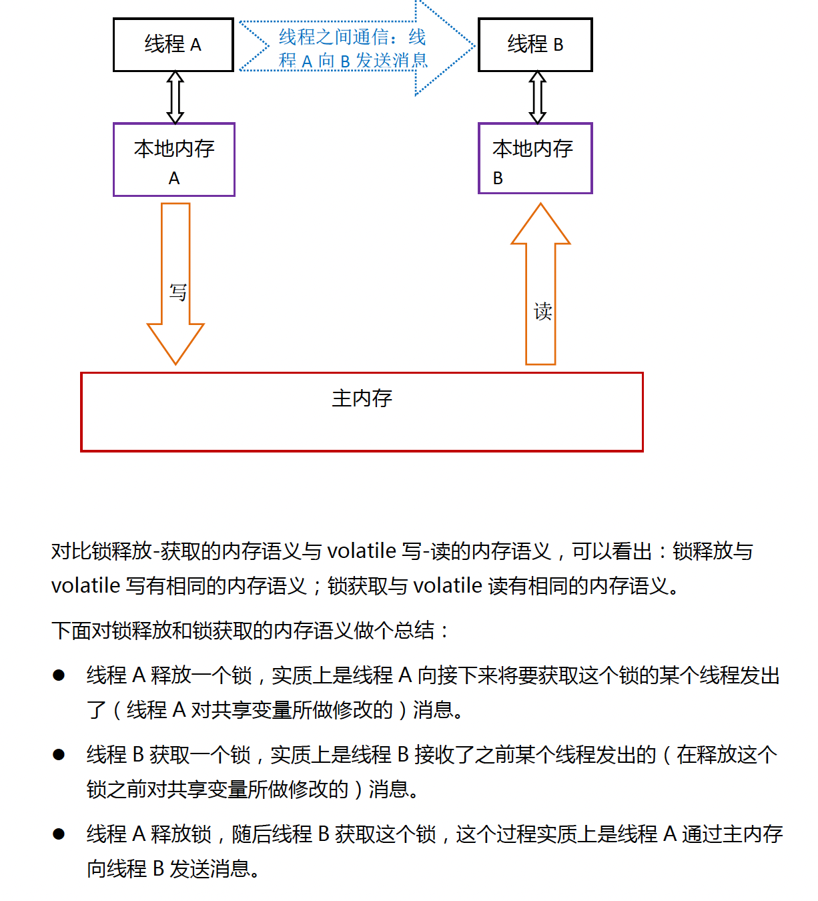

### Volatile的特性

了解volatile特性得一個好方法是把這類的宣告看成是使用了同一個鎖對這些讀/寫操作做了同步.

下面兩段程式互相等價

```java
class VolatileFeatureExample{
    volatile long a = 0L;
    
    public void set(long l){
        a = l;
    }
    
    public void getAndIncrement(){
        a++;
    }
    
    public long get(){
        return a;
    }
}
```

```java
class VolatileFeatureExample{
    volatile long a = 0L;
    
    public synchronized void set(long l){
        a = l;
    }
    
    public void getAndIncrement(){
        long tmp = get();
        tmp += 1L;
        set(tmp);
    }
    
    public synchronized long get(){
        return a;
    }
}
```

鎖的happens-before規則保證釋放鎖和取得鎖之間記憶體的可見性, 這代表對一個volatile變數讀總是能看到任意thread對這個變數的寫入. <br>
鎖的語意也覺得定臨界區間的執行具有原子性, 意味著即使是64bit long、double只要宣告為volatile則代表讀寫具有原子性. <br>

簡單來說volatile具有以下特性
* 可見性: 對一個volatile變數的讀總是能看到任意thread對這個變數的寫入
* 原子性: 對volatile變數的讀寫具有原子性, 不過 volatile++這種複合操作除外.

#### volatile 寫-讀建立的happens before關係

從記憶體的語意來說, volatile的寫-讀與鎖的釋放-獲取優蕭彤的記憶體效果: <br>
* volatile的寫和鎖的釋放有相同的記憶體語意
* volatile的讀與鎖的獲取有相同的記憶體語意
```java
class VolatileExample{
    int a = 0;
    volatile boolean flag = false;
    
    public void writer(){
        a = 1;                  //1
        flag = true;            //2
    }
    
    public void reader(){
        if(flag){               //3
            int i = a;          //4
        }
    }
    
}
```

假設A thread 執行 writer後 B thread執行reader方法, 根據happens before可分為下列幾點關係
1. 根據程式順序關係: 1 happens before 2; 3 happens before 4
2. 根據volatile規則, 2 happens before 3
3. 根據happens before傳遞性規則, 1 happens before 4

#### volatile 寫-讀的記憶體語意
當寫一個volatile變數時, JMM會把thread對應的local memory刷新到main memory, 下面以VolatileExample為例.

總結:
1. thread A寫入volatile變數, 實際上是thread A向接下來要讀這個變數的thread發出了消息
2. thread B讀取volatile變數, 實際上是thread B接收了之前某個thread發出的消息.
3. thread A寫入volatile變數, 隨後thread B 讀取這個volatile變數這個過程實質上是A透過記憶體向B發送消息

#### volatile 記憶體語意的實現
之前提過重排序分[編譯器重排序以及處理器重排序](重排序.md), 為了實現volatile記憶體語意, JMM會根據規則表限制重排序


<br>
舉例來說, 當第一個操作為普通變數讀寫時如果第二個操作是volatile寫, 則不能重排序這兩個操作.

* 當第二個volatile是寫時, 不管第一個是什麼操作都不能重排序
* 當第一個操作是volatile讀時, 不管第二個操作是什麼都不能重排序
* 當第一個操作是volatile寫, 第二個是volatile讀/寫時不能重排序

為了實現volatile記憶體語意編譯器在生成byte code時會在指令序列中插入記憶體屏障禁止重排序. 
<br> JMM採取保守的插入策略, 透過下面的程式說明
```java
class VolatileBarrierExample{
    int a;
    volatile int v1 = 1;
    volatile int v2 = 2;
    
    void readAndWrite(){
        int i = v1;         //第一個volatile讀
        int j = v2;         //第二個volatile讀
        a = i + j;          //普通寫
        v1 = i + 1;         //第一個volatile寫
        v2 = j * 2;         //第二個volatile寫
    }
}
```
針對readAndWrite()方法, 編譯器生成byte code時會做如下的優化:

注意: 最後的StoreLoad屏障不能省略, 因為第二個volatile寫入後方法會立即return. 
<br>這時compiler可能無法判斷後面是否會讀寫, 保險起見compiler會插入一個StoreLoad屏障. <br>

#### 鎖的釋放-獲取建立的happens before 關係
鎖是java多執行續中重要的同步機制, 除了臨界區間互斥執行之外也能讓釋放鎖的thread向獲取鎖的thread發送消息 (同步本地cache) <br>
```java
class MonitorExample{
    int a = 0;
    
    public synchronized void writer(){      //1
        a++;                                //2
    }                                       //3

    public synchronized void reader(){      //4
        int i = a;                          //5
    }                                       //6
}
```

假設兩個不同的thread一個先執行writer另一個執行reader, 根據happens before規則可以分為幾類
1. 根據程式順序規則: 1 happens before 2, 2 happens before 3, 4 happens before 5, 5 happens before 6
2. 根據監視器鎖規則: 3 happens before 4
3. 根據happens before傳遞性: 2 happens before 5

#### 鎖的釋放-獲取的記憶體語意
當thread釋放鎖時thread對應的local memory更新到main memory. 如下圖: <br>

