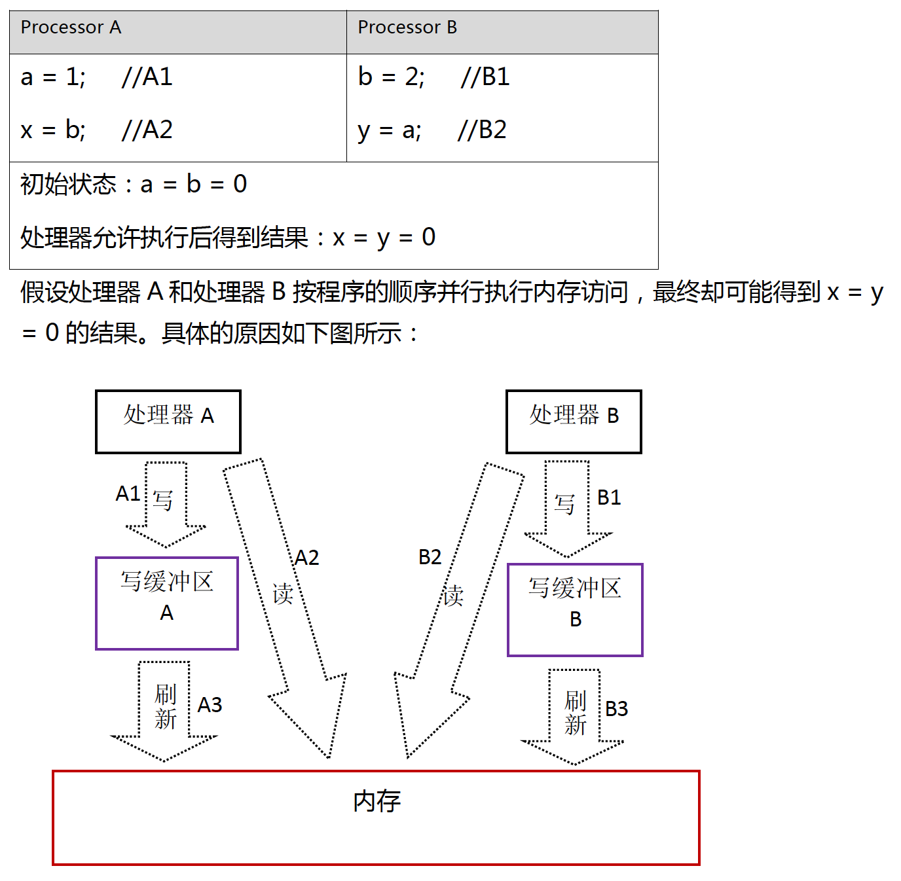
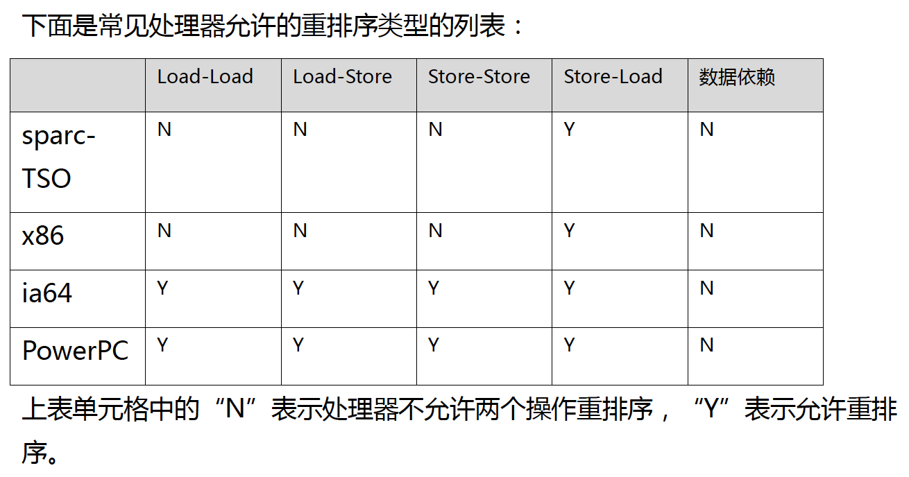
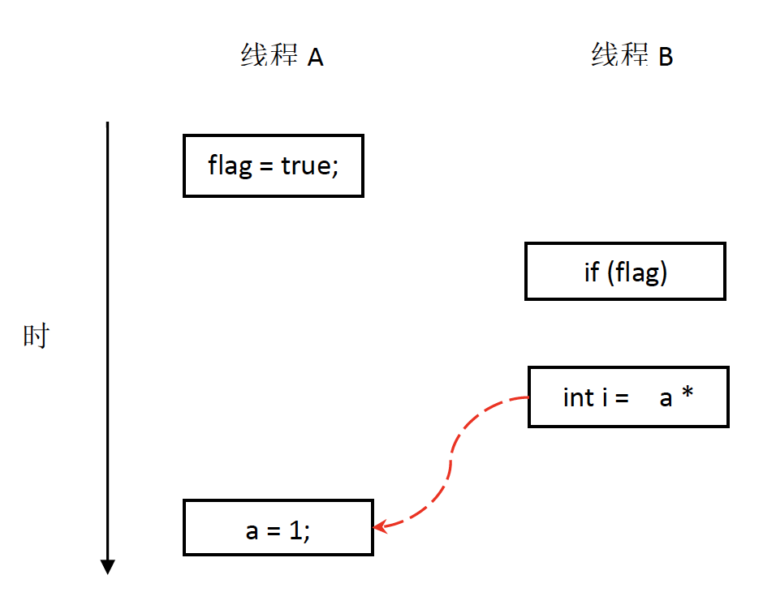

### 重排序

#### 為了提升效能, cpu與compiler常會對指令重排序, 重排序分為以下三種
1. compiler重排序: compiler在不改變單執行緒語意的前提下做指令重排
2. 指令的並行重排序: cpu採用了指令並行技術 (Instruction-Level Parallelism, ILP)
3. 記憶體系統的重排序: 由於cpu有可能使用cache以及read、write buffer, 導致操作看起來像是亂序進行

**Code --> Compile 重排序 ---> ILP --> 記憶體系統重排序 --> 最終執行序列**

這些重排序都有可能導致多執行序的情況下出現資料可見性的問題, <br>
JMM的重排序規則會禁止特定Compiler的重排序, 而也會要求java compiler在生成指令時插入特定類型的記憶體屏障 (memory barriers), <br>
通過記憶體屏障來禁止特定cpu的重排序, JMM屬於語言級別的記憶體模型, 確保在不同的compiler and cpu 都能提供一致的記憶體可見性保證.

<br>

#### cpu重排與記憶體屏障
因現代cpu使用write buffer暫存向memory寫入的資料, 它可以避免因為向主記憶體寫入時造成的等待延遲 <br>
同時也可以透過批量處理的方式flush buffer或合併buffer中對主記憶體的多次寫. 但每個cpu上的buffer只對自己可見, <br>
這個特性會造成對主記憶體的操作順序產生影響, cpu對主記憶體的操作不見得與實際發生的讀寫操作一致, 如下圖 <br> 



執行順序: 兩個cpu同時分別將A1,B1寫入cpu buffer, 然後向主記憶體讀取資料 (A2,B2) <br>
因為buffer 資料尚未更新回主記憶體導致讀取到髒資料, 從順序上來看雖然是先A1再A2但實際上卻是A2,A1的結果. <br>
關鍵是因為cpu buffer 只對自己可見, 導致實際結果與順序上看起來的並不相同. <br>

為了保證記憶體可見性, java compiler會在生成指令時插入記憶體屏障指令. <br>

| 類型          | 範例                          | 說明                     |
|-------------|-----------------------------|------------------------|
| Load-Load   | Load1; Load-Load; Load2     | 確保屏障前的讀取操作都在屏障後的指令之前完成 |
| Store-Store | Store1; Store-Store; Store2 | 確保屏障前的資料早於屏障後的指令刷到主記憶體 |
| Load-Store  | Load1; Load-Store; Store1   | 確保屏障前的讀取在屏障之後完成        |
| Store-Load  | Store1; Store-Load; Load1   | 確保屏障前的寫操作對後續的讀操作可見     |

Store-Load 是全能型的屏障, 同時具有其他三個屏障的功能, 現代cpu大多支援, 但執行開銷會比較昂貴, <br>
因為需要執行 buffer fully flush.



* happens-before: JSR-133使用happens-before概念來闡述操作之間的記憶體可見性, <br> 
如果一個操作的結果需要對另一個操作可見, 那這兩個操作存在happens-before關係, 這兩個操作可以是single-thread、multi-thread, 規則如下
  * 程式順序規則: 在同一Thread中按照程式的順序, 每個操作 happens-before 後面的任何操作
  * 監視鎖規則: 對一個監視鎖的解鎖, happens-before於對這個監視鎖的加鎖
  * volatile變數規則: 對一個volatile變數的寫happens-before於後續任意對這個volatile變數的讀
  * 傳遞性: 如果A happens-before B, 且B happens-before C, 則 A happens-before C
ps. 兩個操作之間有happens-before關係不代表說前一個操作一定要在後一個操作前執行, 而是要求前一個操作的結果對後一個操作可見.

<br>

* 資料依賴性: 如果兩個操作同時操作同一個變數可能會有**寫後讀**、**寫後寫**、**讀後寫** 三種情況, 
<br> 為了不造成結果改變編譯器或處理器會避免針對**資料依賴性**的情況做重排序, 不過這邊指的是**單執行緒**、**單處理器**中執行的操作,
<br> 多執行序多處理器不在考慮範圍內.

* as-if-serial語意: 意指不論如何排序單執行緒的程式執行結果不可被改變, 為了遵守**as-if-serial** 編譯器與處理器不會針對有**資料依賴性**的程式做指令重排.
<br> 舉例:
```java
double pi = 3.14;   //A
double r = 1.0;   //B
double area = pi * r * r;   //C
```

上述程式資料依賴關係為 <br>
A 依賴 C ; B 依賴 C ; <br>
A B 之間不依賴所以可能會被重排序, 但這種重排序不引響結果. <br>
### 所以我們可以說是**as-if-serial語意**在單執行緒的情況下無需擔心重排序問題

從happens-before關係來看上述例子
1. A happens-before B
2. B happens-before C
3. A happens-before C

A happens-before B 但是實際上B卻可以重排序至A之前, 這是因為JMM只要求前一個操作結果對後一個操作可見, <br>
且前一個操作需要在後一個操作之前, 但這邊Ａ並不需要對B可見, 且重排序也不影響結果, 所以JMM認為這裡的重排序合規.

* 重排序對多執行緒的影響, 看下面範例
```java
class RecordExample{
    ina a = 0;
    boolean flag = false;
    
    public void writer(){
        a = 1;                  //1
        flag = true;            //2
    }
    
    public void reader(){
        if(flag){               //3
            int i = a * a;      //4
        }
    }
}
```
flag用來標記a是否已經寫入, 假設有兩個執行續A、B, A先執行writer、B跟著執行reader, 此時B不一定能夠看見a的寫入操作 <br>
原因是因為操作1與2之前沒有資料依賴性、3與4之間也沒有資料依賴性, 所以JMM是可以對這些操作進行重排序的, 可能導致下圖的情況 <br> <br>

<br> <br> 導致a變數根本還沒被寫入執行續B就進行操作了
