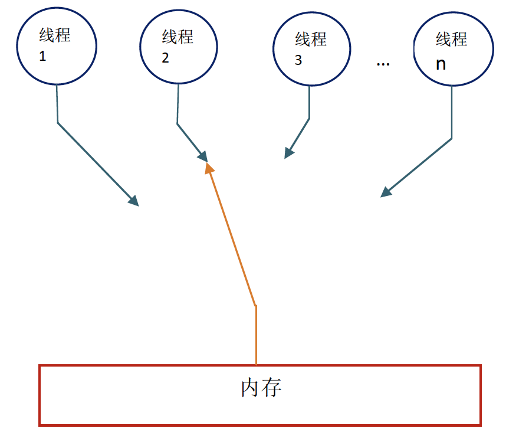
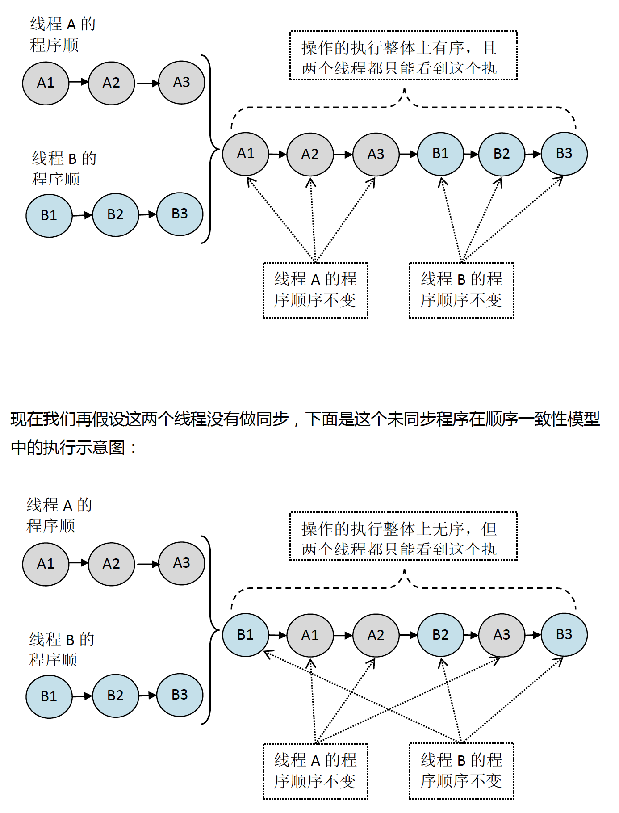
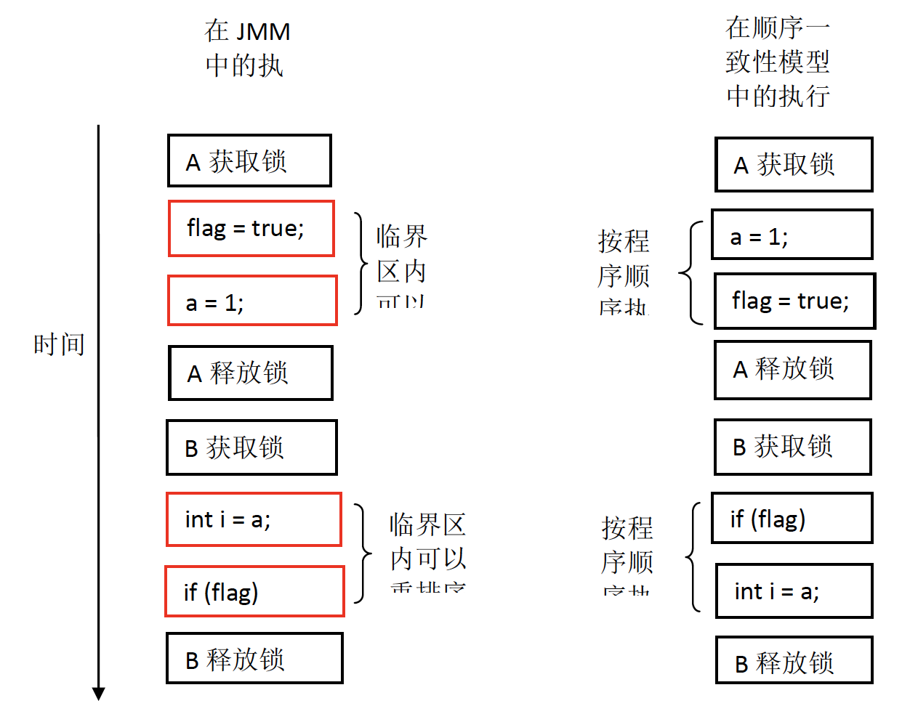
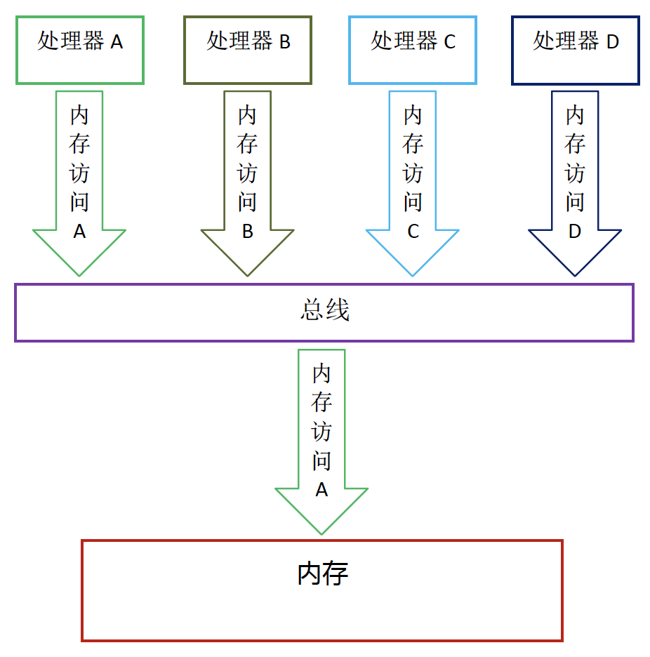
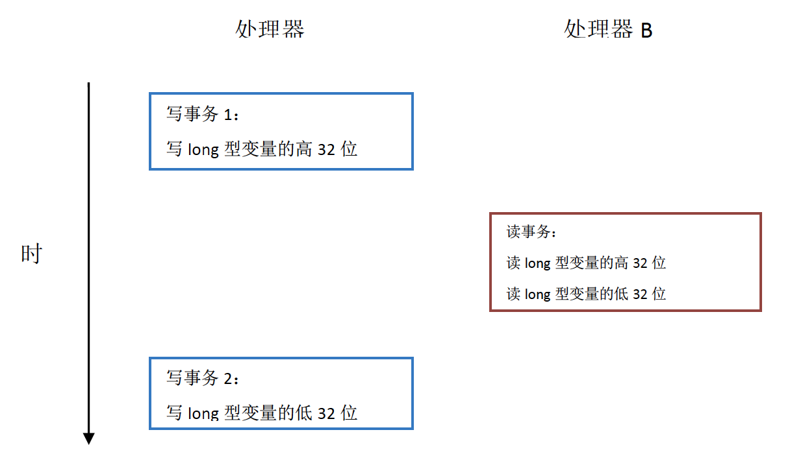

### 順序一致性

* 資料競爭與順序一致性保證
資料競爭定義如下
1. 在一個thread中對A變數做寫的操作
2. 在另一個thread對A變數做讀的操作
3. 讀和寫沒有通過同步來排序
<br> ps. 同步指的是synchronized, volatile, final 

JMM有如下保證
* 如果程式是正確同步的, 程式的執行具有順序一致性 (sequentially consistent) -- 也就是程式的執行結果與順序一致性記憶體模型中的一致性結果相同

#### 順序一致性記憶體模型
順序一致性記憶體模型 (科學家提出的理想化理論參考模型)有兩大特性
* 一個Thread中的所有操作必需按照程式的順序執行
* (不論程式是否同步) 所有Thread只能看到單一的操作順序, 且每個操作需要原子並且立即對所有Thread可見



如上圖所示, 在概念上這個模型會有一個全局記憶體, 這個記憶體透過一個開關連結到任意Thread, 每個Thread按照程式順序讀寫記憶體 <br>
在任意時間點內最多只能有一個Thread可以連接記憶體, 當多執行續執行時途中的開關要能把所有的操作串行化. 下面舉個例子 <br>

假如有兩個同時執行的執行續A與Ｂ, A有三個操作順序是 A1->A2->A3, B同樣也有三個操作 B1->B2->B3, <br>
假設這兩個thread使用監視鎖來同步, A先執行三個操作後釋放鎖, 接著B取得鎖開始執行, 則在順序一致性模型中將如下圖所示

雖然在模型中未同步的執行順序看起來是無序的, 但所有執行續可以看到一個整體一致的順序. <br>
**但是在JMM中沒有這個保證**, 未同步的多執行續中不但執行順序是無序的而且每個執行續彼此看到的順序也不會一致, <br>
那是因為假如當前thread把[資料緩存在本地記憶體中且沒有同步回主記憶體](java記憶體模型的抽象.md), 從其他thread角度看來會覺得根本還沒執行, <br>
必須更新回主記憶體才對其他thread可見. <br>

* 同步程式的順序一致性效果
```java
class RecordExample{
    ina a = 0;
    boolean flag = false;
    
    public synchronized void writer(){
        a = 1;                  //1
        flag = true;            //2
    }
    
    public synchronized void reader(){
        if(flag){               //3
            int i = a * a;      //4
        }
    }
}
```
根據JMM規範, 該程式有同步, 所以執行結果應該要跟順序一致性記憶體模型一致. 下面是兩個模型間的時序圖

可以看到在順序一致性模型中操作全按照程式執行順序, 而JMM允許臨界區間內重排序 (資料沒有相依性, 所以可以重排序) (但不允許逸出到臨界區外, 否則破壞監視器鎖語意) <br>
可以看到雖然A有重排序但因為監視器鎖的關係B根本沒辦法觀察到A的重排序結果. 這種重排序既提升了執行效率又沒有改變結果. <br>
從這裡可以得知JMM的基本方針就是在不改變程式執行結果的情況下 (要正確同步)盡可能為編譯器、處理器的優化開方便之門 <br>

* 未同步程式的執行特性
對於未同步或者不正確同步的多執行續程式, JMM只提供最小安全性: 讀取的值是之前某個thread寫入的 or 默認值(0, null, false) <br>
JMM保證數值不會無中生有. JMM也不保證執行結果與順序一致性模型的結果一致, 未同步程式執行時在JMM上是無序的, 結果無法預知, 兩個模型間有下面幾個差異. <br>
1. 順序一致性模型保證單執行續按照順序執行, 但JMM不保證 (因為資料沒相依性的情況下會被重排序)
2. 順序一致性模型保證所有Thread可以看到相同的執行順序, 而JMM不保證 (因爲會先更新本地緩存, 沒有更新回主記憶體).
3. **JMM不保證64位元 long double 的寫具有原子性**, 而順序一致性模型保證所有讀寫原子性. (理由如下)

在計算機中, cpu與記憶體傳遞資料都需要透過**總線**, 這一系列的操作被稱為總線交易 (bus transaction), <br>
其中包含讀(read transaction)與寫(write transaction)的交易. <br>
read transaction: 記憶體資料傳遞到cpu <br>
write transaction: cpu資料寫入記憶體 <br>
關鍵點是總線會**同步** (串行)同時使用總線的交易, 也就是同一時間只有一個交易能操作記憶體, 如下圖 <br>


<br>
問題點來了, 在一些32bit cpu上要求64bit data 要有原子性可能開銷會過大, 
<br> 所以java 鼓勵但不強求JVM對 long、double的寫具有原子性 (寫不強求, 但讀必需原子) <br>
當JVM在這些cpu上運作時, 一個long/double 拆成兩個32bit的寫來操作, 這兩個寫可能拆為不同的 transaction bus 操作, <br>
此時不具原子性. 當寫long/double不具原子性可能會產生意想不到的結果 (可能會讀到寫一半的數值), 如下圖 <br>



注意, 在JSR 133之前 (JDK5以前), 64 bit long/double 的讀與寫為非原子 (也就是可以拆成兩個32bit操作), <br>
而JSR 133之後只允許64 bit long/double 的寫操作為非原子. 讀的部分都要在同一個read transaction操作完畢.
