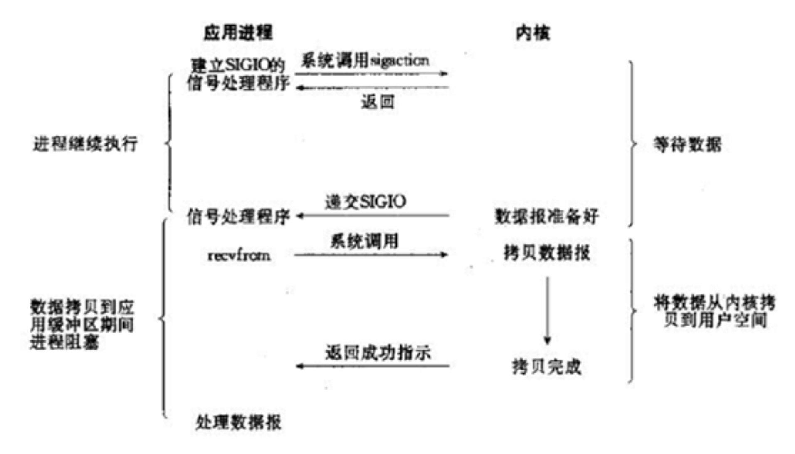

### 五種IO模型

#### 什麼是IO
IO就是應用程式與外部設備資料傳輸的過程, 一般來說IO分有網路、硬碟 (記憶體不是)  
而要知道作業系統的定址被分為用戶空間 (user space)、內核空間 (kernel space),  
一般我們撰寫的應用程式使用的都是用戶空間, 只有需要系統級別的操作時才能透過 system call 去呼叫系統替我們操作內核空間  
IO操作就是需要依賴內核空間, 當應用程式想要執行IO操作一般會歷經兩個步驟.  
1. 內核等待外部設備準備好資料
2. 內核將資料從內核空間複製到用戶空間

#### 五種IO模型
* 阻塞IO模型

user process發起IO請求後就一直被阻塞, 歷經內核等待外部設備準備好資料、內核空間資料複製到用戶空間兩階段
1. 應用: Java BIO
2. 特點
   1. process阻塞不消耗cpu
   2. 實現難度低
   3. 適合concurrent低的環境

* 非阻塞IO模型
  
user process發起IO請求後如果內核資料尚未就緒就會直接返回一個錯誤,  
user process 就採用輪詢的方式一直問到資料就緒為止, 接著開始阻塞直到資料複製完畢
1. 應用: socket (非阻塞模式)
2. 特點
   1. 輪詢調用消耗cpu資源
   2. 實現難度低, 但比bio難
   3. 適合concurrent低的環境
   4. 用輪詢解決BIO組塞問題, 可能有大量thread都在輪詢

* IO多路復用
  
多個Thread的IO可以註冊到一個復用器上(select), 由一個特定thread專門呼叫select, 檢查所有監聽的IO資料是否準備好  
若有任何IO資料準備好則通知對應IO的Thread讀取內核資料
1. 應用: select、poll、epoll三種, nginx這三種都可以選擇、Java NIO、Java Reactor
2. 特點
   1. 使用一個專門的thread解決阻塞問題, 效能好
   2. 實現難度較高、開發應用難度也較高
   3. 適合concurrent高的環境
   4. 解決大量thread輪詢導致cpu資源消耗的問題

* 信號驅動IO模型
  
user process 向內核註冊, 然後不阻塞返回, 當資料準備就緒時透過信號通知 user process前來取得資料
1. 特點: 
   1. 實現、開發難度大
   2. 解決IO多路復用select輪詢 (大多數的輪詢是無用的)

* 異步IO模型
  
user process 向內核發起一個io操作, 不阻塞直接返回, 當資料準備就緒且複製到用戶空間後通知user process
1. 應用: Java AIO
2. 特點
   1. 整個流程都沒有組塞, 一步到位
   2. 需要kernel支援, linux 2.6之後
   3. 實現、開發難度大
   4. 適合concurrent高的環境
   5. 最一勞永逸的模型

#### 比較
