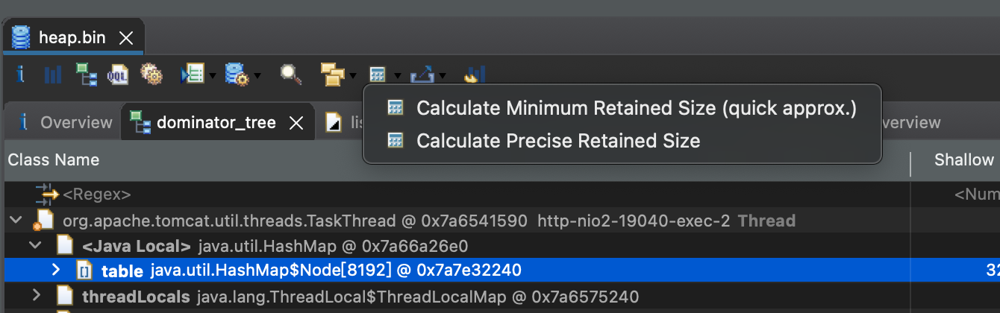

### Memory Analyzer Tool (MAT)

* eclipse開發的java memory dump 分析工具, intellij 也有類似的工具
* 安裝方式
  * [獨立下載](https://projects.eclipse.org/projects/tools.mat)
  * 安裝eclipse 利用裡面的market安裝

* 基礎觀念
  * GC Root: 代表使用可達性分析來判斷物件是否可被回收, 從gc root出發可以透過引用關聯到的物件就是存活的, 反之無法透過gc root訪問的物件就是可被回收
  * Shallow Heap: 代表自身且不含引用物件所佔用的記憶體大小
  * Retained Set: 該對象被回收後所有能被回收的物件集合 (包含所有引用)
  * Retained Heap: 該對象被gc後可被回收的記憶體大小
  * Dominator tree: 如果指向物件Y的路徑都經過物件X, 則說X支配(dominate) Y

  * OQL: 類似SQL的Mat專用查詢語言
  * outgoing references: 該物件引用的外部對象 (物件細節可在左邊inspector視窗查看)
  * incoming references: 引用該物件的物件 (物件細節可在左邊inspector視窗查看)
  
* 功能概述
  * Dominator tree: 展現物件的支配關係, 可按Retain Heap排序 (常用)
  * Histogram: 展現每個class記憶體佔比, 可按package、class loader、super class、class 分群 (常用)
  * Leak Suspects: 直接展示一些可疑的物件, 協助分析
  * Top Consumers: 顯示哪些class、class loader、package記憶體佔比
  * Thread overview: 顯示stack frame狀態、Thread name、記憶體佔比、local記憶體佔比、其餘thread資訊 (常用)
  * Path To GC Roots: 提供到該class的gc路徑, 分析無法被gc的原因


#### 實際分析
```java

@Data
@AllArgsConstructor
@NoArgsConstructor
public class Goods {
  private String name;
  private Double price;
  private String[] types;
}

    @GetMapping("/")
    public String test(@RequestParam(defaultValue = "1") Integer times) throws InterruptedException {
        Map<String, Goods> map = new HashMap<>();
        int counter = 1;
        if(true){
            while (true) {
                Thread.sleep(10);
                Goods goods = new Goods();
                String[] types = new String[counter];
                for (int i = 0; i < types.length; i++) {
                    types[i] = "type" + i;
                }
                goods.setName("hresh" + counter);
                goods.setPrice(Double.valueOf(counter));
                goods.setTypes(types);
                map.put(goods.getName(), goods);
                if (counter % 100 == 0) {
                    System.out.println("put" + counter);
                }
                counter++;
            }
        }
        return "success";
    }
```

先從**Dominator tree**查看所屬關係與記憶體佔比, 發現是TaskThread下面的HashMap佔用很多記憶體, 這邊也看得出來Thread Name (http-nio2-19040-exec-2)

<br>
查看一下這個HashMap內部持有的物件

定位到問題

從dominator tree得知http-nio2-19040-exec-2佔用很多記憶體, 改從Thread overview查看也可定位到問題


#### TIPS
有時候面板沒有出現retained Heap 的資訊可點選下圖計算

分群

這是一個比較簡單的案例, leak suspects直接點出懷疑memory leak的點, 還有列上stack trace


<br>
<br>

##### 參考文章
* https://juejin.cn/post/6908665391136899079
* https://juejin.cn/post/6911624328472133646