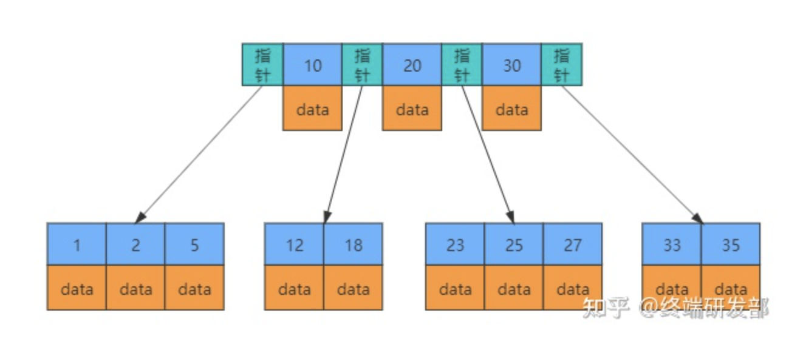
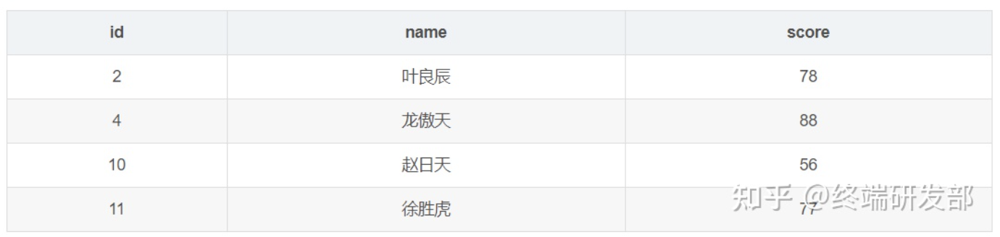
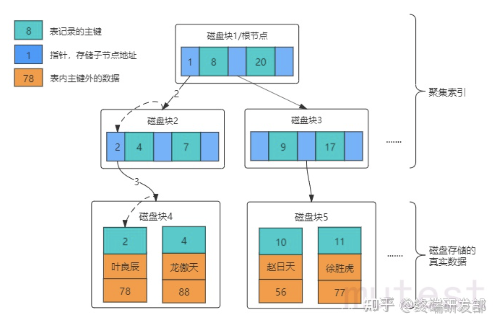
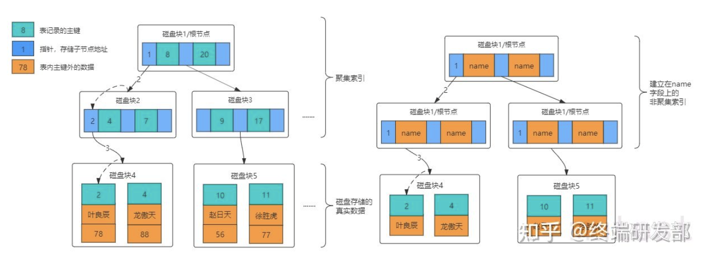
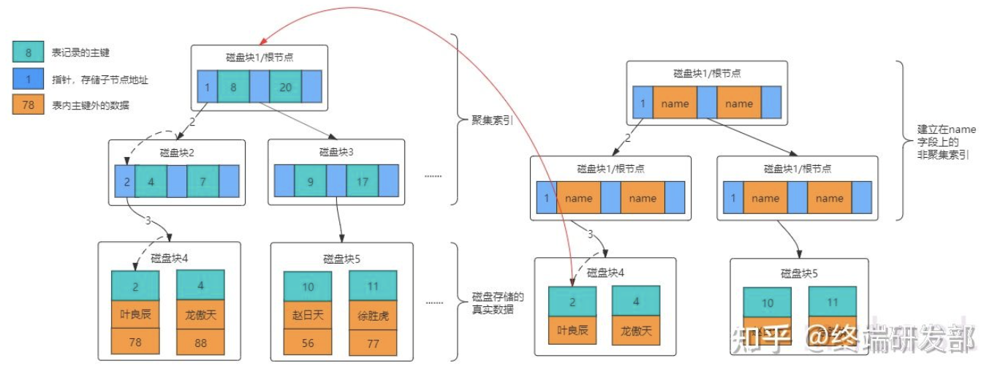
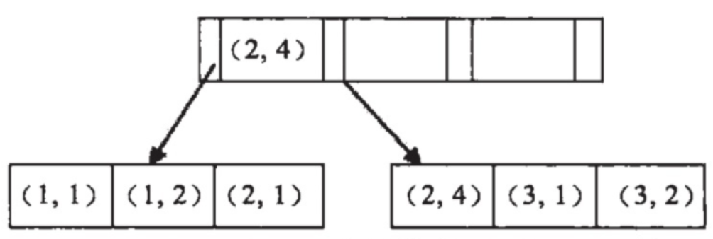
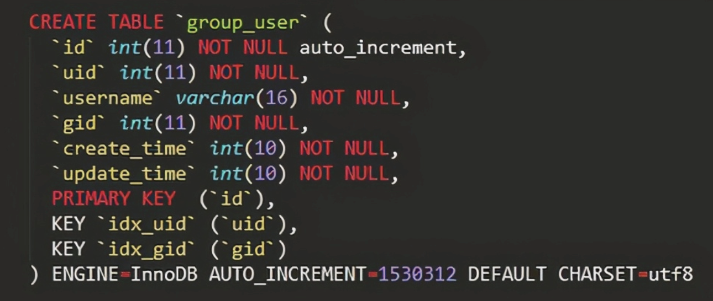
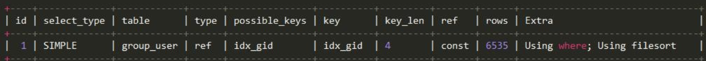
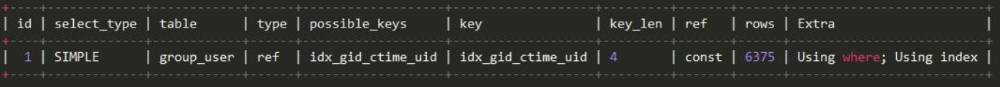

### Index

#### 索引原理探究
* 什麼是資料庫索引: 索引是一種單獨的、物理的對資料庫表中一列或多列的值進行排序的一種儲存結構, <br>
  是某個表中一列或多列的集合以及相對應指向物理標記這些資料頁的邏輯指針清單. <br>
  (其實解讀成圖書目錄就可以了, 如果想在圖書館藏中找到書或者特定內容, 沒有目錄的狀況下只能一本一本去翻.) <br>
  
* B Tree And B+ Tree: 相對CPU與記憶體操作, 硬碟IO開銷很大, 會成為系統效能瓶頸, 因此MySQL針對這部分做了優化. <br> <br>
ps. 當從硬碟讀取資料時會將周遭的資料也一起讀入記憶體內, 而不是單單只有當前硬碟地址地資料 (局部預讀性原理), <br>
當電腦訪問硬碟上某位址時其附近區域的資料很快也會被讀取到. 每次硬碟IO都會讀取一頁 (page, 多大取決於作業系統, 一般是4k or 8k). <br> <br>


索引之所以會加快硬碟訪問速度其根本原因就在於減少了訪問硬碟IO次數, 下面簡單講一下B Tree And B+ Tree <br>
B-Tree簡略示意圖 (借用一下網路上的圖) <br>

特點:
1. 樹內每個節點都儲存資料
2. 樹葉間無指針連結
3. 是一個平衡樹
<br>
   
B+ - Tree簡略示意圖

特點:
1. 只有葉節點儲存資料
2. 葉節點之間互有指針連接

MySQL InnoDB 預設索引引擎為B+ Tree Why?
1. B+樹透過葉節點訪問可有效率的做到範圍查詢, 減少IO次數
<br>
   
* Clustered Index (叢集索引) And Secondary Index (非叢集索引) <br>
Clustered Index: 資料庫資料存放數據與index順序相同, 表的物理順序只可能有一種, 所以叢集索引只會有一個 (primary key, 更快的執行速度). <br>
1. 在InnoDB中, 叢集索引默認就是Primary Key
2. 如果表中沒有定義PK, 則該表中第一個唯一非空索引被作為叢集索引
3. 如果沒有PK也沒有唯一索引則InnoDB內部會生成隱藏主鍵作為叢集索引(6 byte的字增列)
ps. pk是uuid而非自增就會產生一個問題, 因為如果是自增的資料一定是放在相鄰的硬碟上的, 寫入性能佳, uuid因為具有隨機性, 會導致隨機io, 寫入效能差. <br>
   
假設有下表 (id為pk, name為一般index)

當執行 ```SELECT name FROM student WHERE id=2;``` 時, 查詢過程如下

1. 先找到樹根所在硬碟區塊, 讀入記憶體 (第一次Disk IO) (其實InnoDB會將樹根常駐記憶體)
2. 在記憶體中判斷id=3鎖在區間 (1,8), 找到區間對應指針 (第一次記憶體查找)
3. 根據指針1紀錄的硬碟位置找到硬碟區塊2讀入內存 (第二次Disk IO)
4. 在記憶體中判斷id=3所在區間(2,4), 找到對應指針 (第二次記憶體查找)
5. 根據指針2紀錄的硬碟位置找到硬碟區塊4讀入內存 (第三次Disk IO)
6. 在記憶體找到id=2的對應資料 (第三次記憶體查找)

Secondary Index: 如下圖, 多加一個索引就多生成一顆非叢集索引樹, 新增資料時同時需要維持這幾棵樹的變化. <br>
非叢集索引樹葉上已不是真實資料而是索引自身值與主鍵索引值.   

當執行下面SQL時
```text
SELECT id,name FROM student WHERE name='叶良辰';
```
查詢過程跟叢集索引一樣, 只需要掃描一次樹, 就可以拿到想要的資料, 但如果下面的SQL情況就不同了 (score非index)
```text
SELECT score FROM student WHERE name='叶良辰';
```

因走訪完樹後只能得到id,name, 所以利用id再去叢集索引查詢score, 需要兩段這個過程稱為**回表** <br>

* 聯合索引: 指對表上多個列進行索引 (有序), 與單個索引建立方法一樣, 不同的是有多個索引列且索引方式有順序性. 對於SQL是否用到索引有下列幾種情況. <br>
1. 全列匹配: 當WHERE條件內的搜尋條件全部都是聯合索引內的欄位時是可以使用到索引的, 但要注意的是理論上WHERE條件內的順序要與聯合索引內的順序相同, <br>
但是MySQL的查詢優化器會自動調整WHERE句子的順序,匹配適合使用的索引, 所以若順序不相同但效果是一樣的.
2. 最左匹配: 如果WHERE條件使用到聯合索引的最左邊的索引, 那麼這條SQL就可以利用聯合索引匹配, 但若遇到範圍查詢則會停止. <br>
   舉例對(a,b)字段建立索引, 也就是說WHERE為
```text
a=1
a=1 and b=2
```
是可以使用到索引的, 但執行
```text
b=2
```
就沒辦法使用索引了. <br>
若對(a,b,c,d)建立索引, WHERE條件為
```text
a=1 and b=2 and c>3 and d=4
```
此時a,b,c三個字段可以用到索引, d就沒辦法因為遇到了範圍查詢 <br>
假如說索引為(a,b), 看下圖

資料是先按照a來排序的, a相等的情況下才對b排序. <br>
```text
a的順序為 1,1,2,2,3,3 b順序為1,2,1,4,1,2 
可以說a是有序的, b是全局無序但局部有序, 這是什麼意思呢?
當a決定時b是有序的. 例如a=3時b是有序的, 因此a=1 b=2 是可以用到索引的,
而a>1 b=2只有a能用到索引,b用不到,因為a是一個範圍不是固定的所以b就無序了.
以上述來看, 最左匹配原則, 在遇到範圍查詢後就會停止匹配.
```
題型:
```text
Q: SELECT * FROM table WHERE a = 1 and b = 2 and c = 3;
如何建立索引?
A: (a,b,c) (b,a,c) (c,a,b) ... 都可以, 但是重點是將區分度對高的字段放前面, 區分度低的放後面, 像性別、狀態這種就放後面
```
```text
Q: SELECT * FROM table WHERE a > 1 and b = 2; 
如何建立索引?
A: (b,a) , 因為(a,b)的話只有a可以用到索引, (b,a) 可以兩個字段都用上索引, WHERE條件的順序沒差, MySQL會幫忙優化順序
```
```text
Q: SELECT * FROM `table` WHERE a > 1 and b = 2 and c > 3; 
如何建立索引?
A: (b,a) or (b,c) 都行, 看具體情況分析
```
```text
Q: SELECT * FROM `table` WHERE a = 1 ORDER BY b;
如何建立索引?
A: (a,b) , a=1的情況下b有序
```
```text
Q: SELECT * FROM `table` WHERE a IN (1,2,3) and b > 1; 
如何建立索引?
A: (a,b) , IN可視同等值用法, 所以還是(a,b)
```
<br>
3. Like %開頭: 不符合最左匹配, 無法用到索引 <br>
4. 查詢條件含有函式或表達式無法使用索引 <br>

* 覆蓋索引 (避免回表)
如果一個索引覆蓋 (包含)了所有需要查詢的欄位, 這個索引就是覆蓋索引. <br>
因為索引中已經包含了要查詢欄位的值 (單列索引或聯合索引), 所以就可以不用再回表了. <br>
ex: 考慮下圖的表內涵150w筆資料.

一個簡單的SQL需要花費1秒
  
```text
SELECT uid FROM group_user WHERE gid = 2 ORDER BY create_time ASC LIMIT 10;
```
Explain 結果是

查詢已使用到了索引, 但還是慢原因是因為排序的部分使用了Using filesort檔案排序, 查詢效能低, 再來就是因為欄位不在索引上所以還需要回表. <br>
解決方式: 新增一個聯合索引避免回表與檔案排序
```text
ALTER TABLE group_user ADD INDEX idx_gid_ctime_uid(gid,create_time,uid);
```
再次Explain結果為

Extra資訊已有Using Index, 表示使用覆蓋索引. <br>

