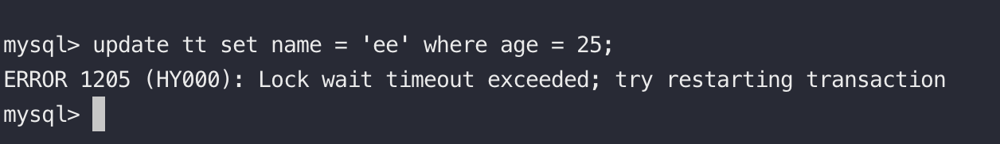

### MySQL - Lock

#### InnoDB鎖的模式
1. 讀鎖, 簡稱S鎖, 一個交易獲得了某資料的S鎖, 其他交易也可以獲得這筆資料的S鎖, 但是不能對這筆資料做修改. <br>
   利用 select ... lock in share mode 加上S鎖, 若同想申請寫鎖就會被阻塞. <br>

ps. 一般自動提交的select查詢是不加鎖的, 稱為 **consistent read**, RR level下會讀取該查詢時間點下的**snapshot**, RC level 下查詢資料時會去重設**snapshot**

2. 寫鎖, 簡稱X鎖, 一個交易若取得某資料的X鎖, 其他交易就不能獲取同筆資料的任何鎖否則阻塞. (例如select ... for update)
3. Meta Data Lock, 簡稱MDL鎖, 用於保證表中meta data. 在開始一個交易時會自動獲得MDL鎖, 其他的交易就不能執行DDL操作 (例如改變欄位, 會阻塞), 用來確保數據之間的一致性. <br>
ex: 開啟一筆交易同時去改變表結構 <br>

變更表結構的同時卡住了, 等待MDL鎖釋放


<br>
4. 意向鎖 (ntention Locks), 用於**表鎖**, 分為下列兩種. <br>
* 意向共享鎖 (IS): 是指在給某個row加上共享鎖之前必需先取得IS鎖.
* 意向排他鎖 (IX): 是指在給某個row加上排他鎖之前必須先取得IX鎖.
<br>

#### InnoDB鎖的種類
ps. 隔離級別RR且innodb_locks_unsafe_for_binlog = 0 的條件下 <br>
1. Record Locks (行鎖): 鎖是加在索引身上, 若表中沒有任何索引則會使用隱藏的叢集索引. <br>
ex: age 為index 的情況下, 兩個transaction 分別對age 20 update, 其中一條transaction卡住等待 record lock. <br>
T1

T2 

當我們把age index 刪除時發生了奇怪的事情 <br>
T1

T2 明明是不同條紀錄但卻卡住了 (猜測應該是把所有的row 都上鎖了)


2. Gap Lock (間隙鎖): RR隔離級為了避免幻讀加入了Gap Lock, 鎖定行紀錄範圍, 不允許在此範圍內新增或變更任何資料. <br>
ex: 將age<26的資料加上讀鎖, 另一個交易無法在鎖住的區間新增資料 <br>
T1讀鎖鎖住區間

T2出現等待


3. Next-Key Locks: 是Record Lock 與 Gap Lock 的組合, 會先對選定的索引加上鎖, 再對資料兩邊的邊界加上鎖. <br>
ex: 對age < 26 的資料加上寫鎖, 另一個交易新增一筆age 26時居然卡住了, 代表不光鎖定了 age < 26 範圍還鎖了 26本身. <br>
T1寫鎖鎖住區間

T2區間外新增資料出現等待超時

   
<br>

#### InnoDB鎖的監控
習慣性透過 **show full processlist** 、 **show engine innodb status**  來分析問題, 但其實還有這三個表與鎖有關. <br>
* information_schema.INNODB_TRX:

```text

mysql> select * from INNODB_TRX \G;
*************************** 1. row ***************************
                    trx_id: 7038   <----- 交易id
                 trx_state: LOCK WAIT   <----- 交易狀態   
               trx_started: 2021-06-20 16:53:24   <----- 交易開始時間
     trx_requested_lock_id: 7038:47:4:2
          trx_wait_started: 2021-06-20 16:53:24
                trx_weight: 2
       trx_mysql_thread_id: 6   <----- mysql 內部thread id與processlist對應
                 trx_query: update tt set name = 'qoo' where age = 20 <----- sql 語句
       trx_operation_state: starting index read   <----- 交易運行狀態
         trx_tables_in_use: 1
         trx_tables_locked: 1
          trx_lock_structs: 2
     trx_lock_memory_bytes: 1136
           trx_rows_locked: 1
         trx_rows_modified: 0
   trx_concurrency_tickets: 0
       trx_isolation_level: REPEATABLE READ
         trx_unique_checks: 1
    trx_foreign_key_checks: 1
trx_last_foreign_key_error: NULL
 trx_adaptive_hash_latched: 0
 trx_adaptive_hash_timeout: 0
          trx_is_read_only: 0
trx_autocommit_non_locking: 0
*************************** 2. row ***************************
                    trx_id: 7037
                 trx_state: RUNNING
               trx_started: 2021-06-20 16:53:19
     trx_requested_lock_id: NULL
          trx_wait_started: NULL
                trx_weight: 5
       trx_mysql_thread_id: 5
                 trx_query: NULL
       trx_operation_state: NULL
         trx_tables_in_use: 0
         trx_tables_locked: 1
          trx_lock_structs: 4
     trx_lock_memory_bytes: 1136
           trx_rows_locked: 3
         trx_rows_modified: 1
   trx_concurrency_tickets: 0
       trx_isolation_level: REPEATABLE READ
         trx_unique_checks: 1
    trx_foreign_key_checks: 1
trx_last_foreign_key_error: NULL
 trx_adaptive_hash_latched: 0
 trx_adaptive_hash_timeout: 0
          trx_is_read_only: 0
trx_autocommit_non_locking: 0
2 rows in set (0.00 sec)

```

* information_schema.INNODB_LOCKS:
```text

mysql> select * from INNODB_LOCKS \G;
*************************** 1. row ***************************
    lock_id: 7038:47:4:2
lock_trx_id: 7038   <----- 交易ID
  lock_mode: X   <----- 鎖的模式
  lock_type: RECORD   <----- 鎖的類型
 lock_table: `test`.`tt`
 lock_index: index_tt_age   <----- 鎖定的index
 lock_space: 47
  lock_page: 4
   lock_rec: 2
  lock_data: 20, 1   <----- 鎖定的資料與行號
*************************** 2. row ***************************
    lock_id: 7037:47:4:2
lock_trx_id: 7037
  lock_mode: X
  lock_type: RECORD
 lock_table: `test`.`tt`
 lock_index: index_tt_age
 lock_space: 47
  lock_page: 4
   lock_rec: 2
  lock_data: 20, 1
2 rows in set, 1 warning (0.00 sec)

```

* information_schema.INNODB_LOCK_WAITS:
```text

mysql> select * from INNODB_LOCK_WAITS \G;
*************************** 1. row ***************************
requesting_trx_id: 7038   <----- 交易id
requested_lock_id: 7038:47:4:2
  blocking_trx_id: 7037   <----- 等待交易的id, 此例 7038 正在等 7037 交易結束
 blocking_lock_id: 7037:47:4:2
1 row in set, 1 warning (0.00 sec)

```
