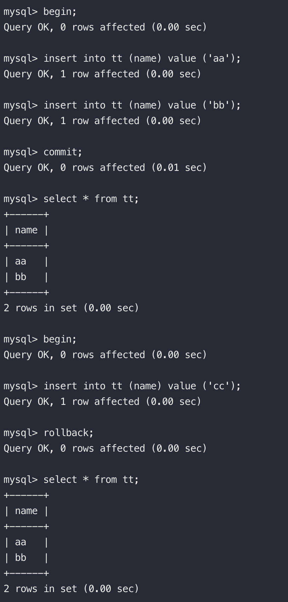
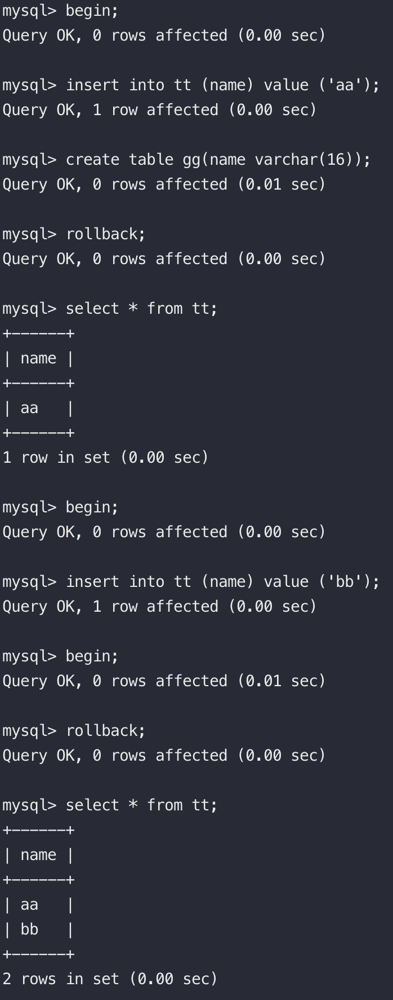
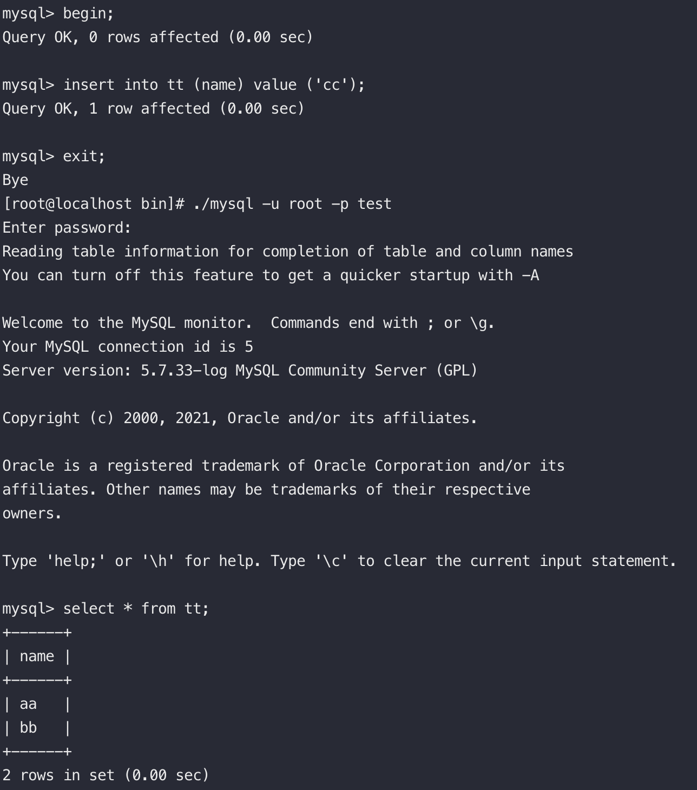

### Transaction - 語法   

#### 顯式交易
交易語法是由 begin or start transaction 開始的, 或者把 autocommit 關掉 (set autocommit = 0)  
交易結束語法通常使用 commit or rollback "顯式"結束.   

   

#### 隱式交易
隱式提交可以是1.DDL語法 2.再次輸入begin or start transaction.  
隱式回滾可以退出session、連接超時or關機.    

隱式提交

   
隱式回滾

