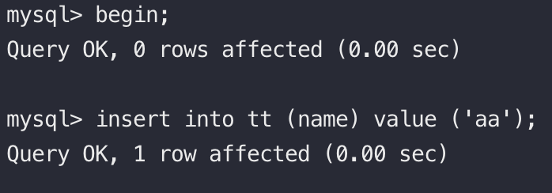
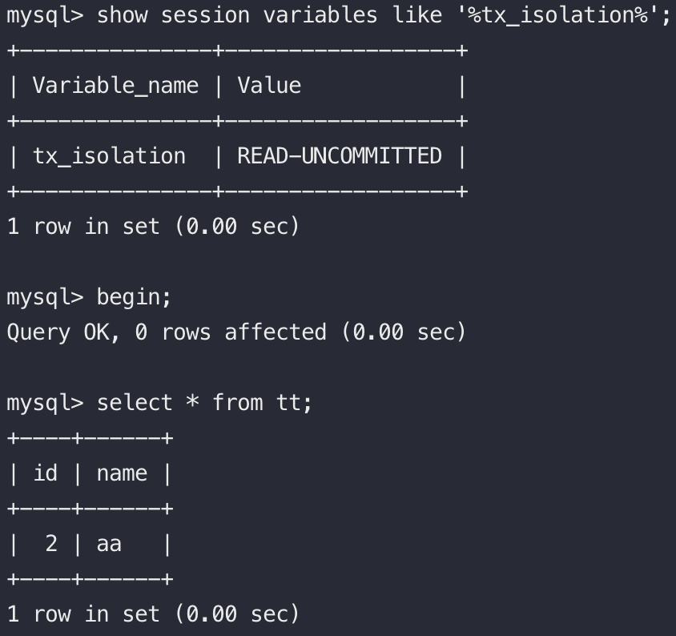
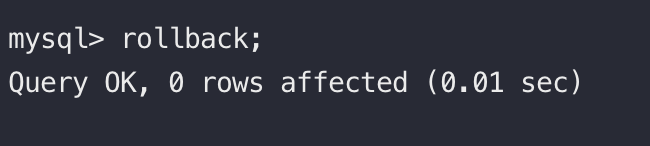
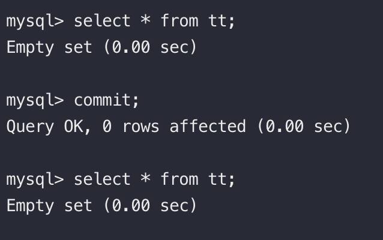
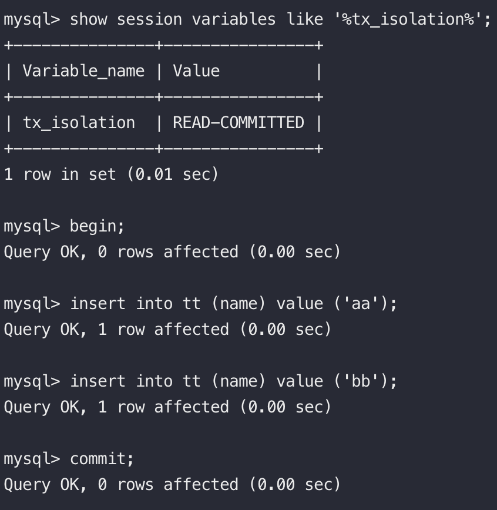
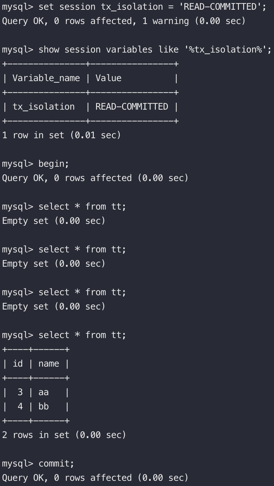
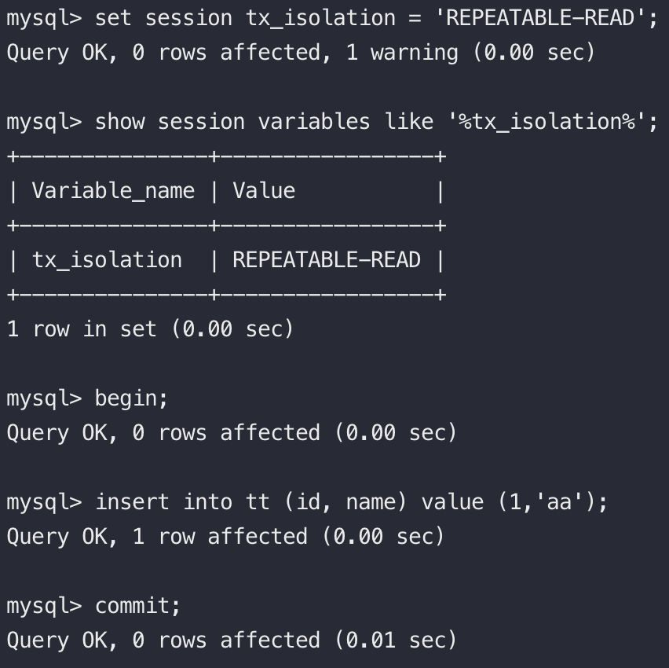

### Transaction - 隔離級別   

MySQL innoDB實現SQL4種標準隔離級別用於限定事務哪些改變是可見的, 低級別支持更高的多執行續處理能力並有更低的系統開銷.  
可以通過 show (session global) variables like '%tx_isolation%'; 查看隔離級別  
ps. MySQL預設隔離級別為REPEATABLE-READ   

1. 讀未提交 (Read Uncommitted): 簡稱RU, 在交易中可以讀到其他交易未提交的資料. 這種現象也被稱作髒讀, 會發生髒讀、不可重複讀、幻讀  
2. 讀已提交 (Read Committed): 簡稱RC, 在交易中可以讀到其他交易已經提交的資料. 這種現象也被稱作不可重複讀, 會發生不可重複讀、幻讀  
3. 可重複讀 (Repeatable Read): 簡稱RR, 在一個交易期間所看到的資料不會改變. 避免髒讀、不可重複讀、幻讀的現象 (無法完全避免).  
4. 串行 (Serializable): 在每個讀的資料行上都加上表級共享鎖, 每個寫的資料都要加上表級排他鎖. 會造成InnoDB多執行續能力下降, 大量超時與鎖競爭會發生.   

#### 隔離級別所產生的現象  

* 髒讀: RU級別下會出現的狀況, 也就是會讀到其他交易未提交的資料.  
T1 T2 分別開啟了一個交易, T2新增了一筆資料, 但尚未commit, T1卻讀到了這筆資料.  
T2

T1

T1

T2 rollback了, 接著T1之前讀取到的資料也跟著消失了

T1

   

* 不可重複讀: 交易期間讀取到其他交易修改過的資料導致同一個交易內前後兩次讀取的資料不一致.  
T1 T2 分別開啟了交易, 一開始T1沒有查到任何資料, 直到T2新增了資料並commit後, 導致前後幾次查詢到的資料不一致.  
T2
  
T1

   

* 幻讀: 交易中某一次的查詢操作所得的資料狀態無法支撐後需的業務操作.  
ex: 先查詢某紀錄是某存在, 若不存在則新增資料, 新增時發現資料已存在報錯.  
T1 T2 分別開啟了交易, T1先查詢存不存在id=1資料, 正要新增時T2搶先新增了, 導致T1新增資料失敗.  
T1
  
T2

  
幻讀這塊網路上眾說紛紜, 各種解釋都有, 待未來的我繼續修正補充