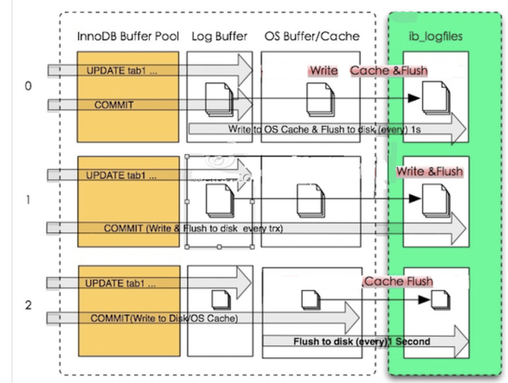
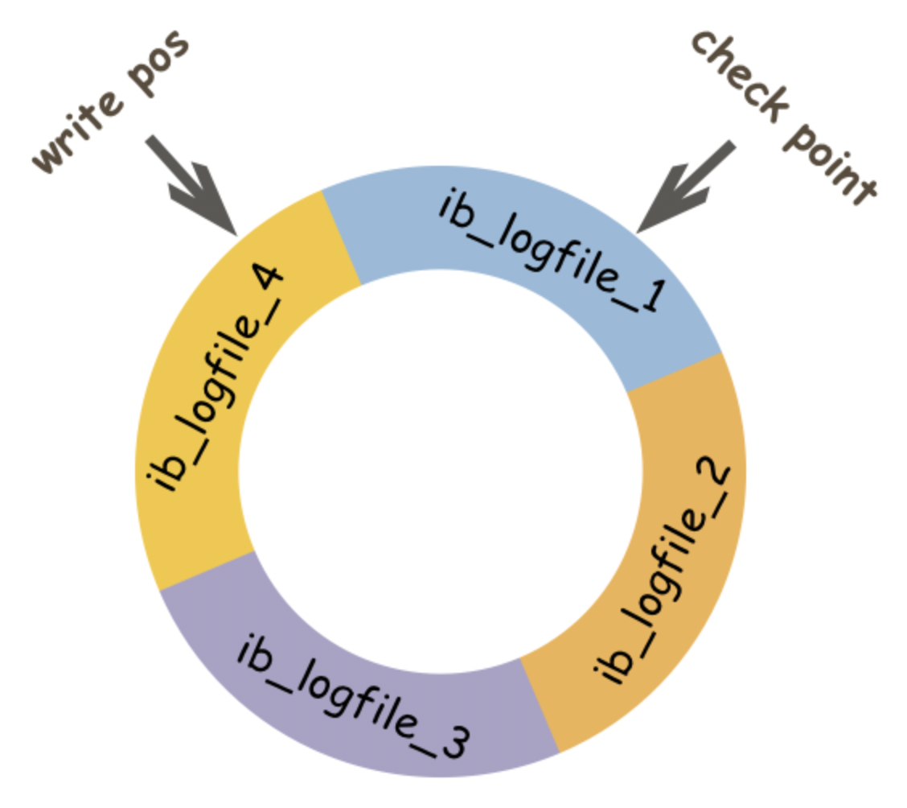

### Redo Log  
redo log用於記錄事務操作的變化, 不管事務是否提交都會記錄下來, 在MySQL crash 重啟時用於恢復資料, 保證資料完整性.  

* 理念: MySQL有一個特性是持久性, 只要事務提交成功, 對資料庫的修改就會永久被保存下來, 不會因為其他原因再回到之前的狀態.  
這部分最簡單的做法是只要一提交就把修改過的page刷到硬碟裡面, 但這樣會有效能問題.   
舉例來說: MySQL以page為單位, 有可能這個事務只改了page幾個byte但卻要整頁刷到硬碟裡面, 相對耗資源,  
再來就是這個事務有可能改了好幾頁, 這些頁在物理上不連續導致隨機IO寫入的發生, 效能太差.  
所以設計了redo log, 只記錄對page 做了哪些修改, 就可完美解決問題.   
  
* 基本概念: 這塊分兩部分, 一個是 redo log buffer, 一個是redo log.  
MySQL執行DML時會先將記錄寫到redo log buffer, 之後某個時間點將多筆紀錄寫到redo log 內. (這種先寫log再寫硬碟稱為WAL - Write-Ahead Logging)   

* redo log buffer 寫入redo log時機: (innodb_flush_log_at_trx_commit)  
參數 0 **(延遲寫、延遲刷)**: 事務提交時**不將**redo log buffer 寫入os buffer, 而是每秒一次的頻率並呼叫fsync() 寫入 redo log  
參數 1 **(即時寫、即時刷)**: 事務只要提交就將redo log buffer 寫到 os buffer中並呼叫fsync() 寫入 redo log.  
參數 2 **(即時寫、延遲刷)**: 事務只要提交就將redo log buffer 寫到 os buffer中, 已每秒的頻率呼叫fsync() 寫入 redo log.   

 
* red log  
紀錄page的變更, 硬碟上用ib_logfile(0~N)命名.  
寫的方式為**順序寫、循環寫** 第一個文件寫滿會按順序寫二個, 以此類推, 若最後一個文件寫滿會從第一個文件開始寫.  

 
在innodb中不只有redo log需要刷硬碟還有data page需要刷.  
上圖中, write pos代表redo log 當前**LSN (邏輯序列號)**位置, check point代表data page刷硬碟後對應redo log的LSN位置.  
而check point 到write pos之間的紀錄代表等待刷硬碟的data page修改紀錄.  
當write pos追上check point時會先推動check point 往前動 (刷髒頁), 空出位置後才接著紀錄.  
 
啟動innodb時不管之前是正常還是異常關閉, 都會執行恢復操作 (因為redo log 只是紀錄data page物理變化, 所以恢復時速度很快).  
重啟時首先檢查硬碟中data page的LSN, 如果比redo log中的LSN小, 則會從checkpoint開始恢復.   

